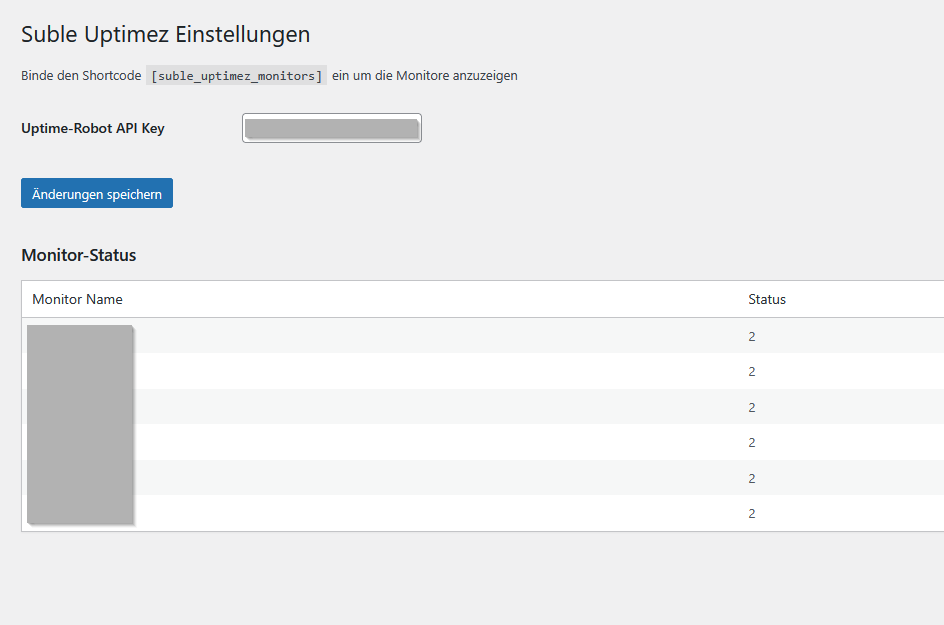
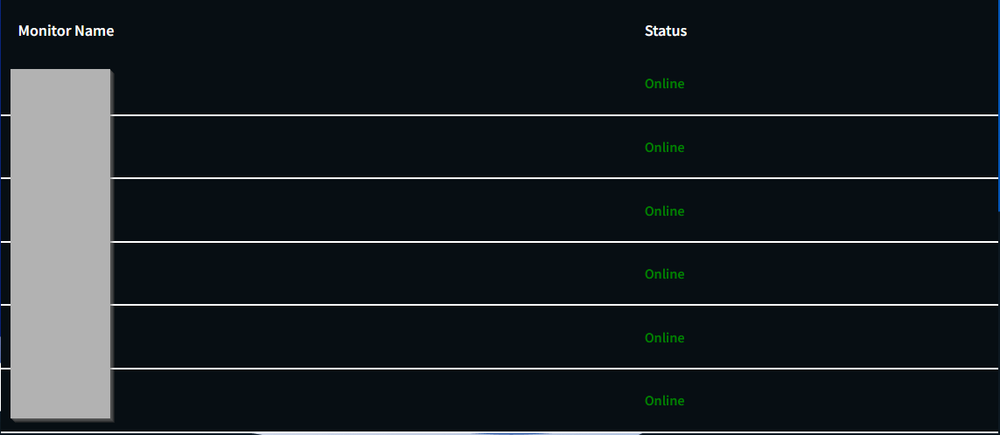
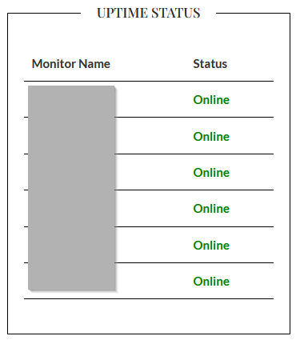

# Suble Uptimez

**Version:** 1.0.0  
**Author:** SubleXBle  
**Plugin URI:** [https://suble.org/](https://suble.org/)  
**License:** GPL2

## Description
Suble Uptimez is a WordPress plugin that displays the uptime status of monitors using the Uptime Robot API.

## Installation
1. Upload the plugin to the `wp-content/plugins` directory.
2. Activate the plugin via the WordPress admin panel.
3. Go to "Suble Uptimez" and enter your Uptime Robot API key (read only).

## Usage
You can use the following shortcode to display the monitor status on any page or post:

[suble_uptimez_monitors]

## Uninstall
The Plugin has its uninstall routine, deaktivate and uninstall via wordpress so it will get triggered and can delete your api key from the wordpress database

## Screenshots

